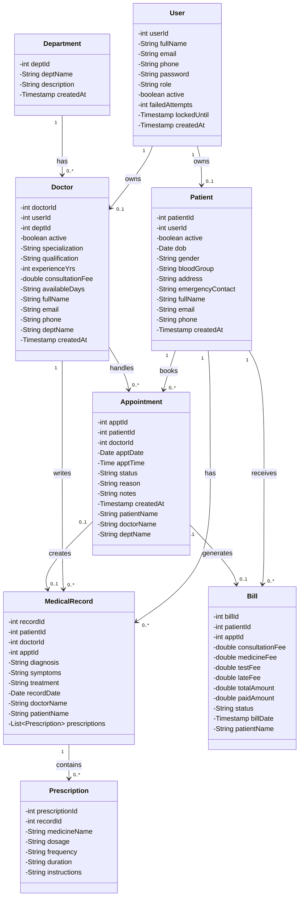

# Java Classes And Main Methods

This project follows the MVC pattern:

- `Model`: JavaBeans, Service classes, and DAO classes
- `View`: JSP pages
- `Controller`: Servlet classes

## Class Diagram

## 1. Controller Layer

### `BaseController`

- `forward(req, resp, path)`  
  Sends the request to a JSP page using `RequestDispatcher`.
- `redirect(req, resp, path)`  
  Redirects the browser to another URL.
- `setFlash(req, type, message)`  
  Stores a temporary success or error message in session.

### `LoginController`

- `doGet(req, resp)`  
  Opens the login page.
- `doPost(req, resp)`  
  Checks login details and sends the user to the correct dashboard.

### `RegisterController`

- `doGet(req, resp)`  
  Opens the register page.
- `doPost(req, resp)`  
  Reads registration form data, creates a patient account, and redirects to login.

### `LogoutController`

- `doPost(req, resp)`  
  Logs the user out by invalidating the session.

### `ForgotPasswordController`

- `doGet(req, resp)`  
  Opens the forgot-password page.
- `doPost(req, resp)`  
  Resets the password after validating the entered details.

### `ContactController`

- `doGet(req, resp)`  
  Opens the contact page.
- `doPost(req, resp)`  
  Validates the contact form and shows a message.

### `AdminController`

- `doGet(req, resp)`  
  Routes admin requests to dashboard, doctor management, patient management, or department pages.
- `doPost(req, resp)`  
  Handles admin actions like add, update, and delete.
- `showDashboard(req, resp)`  
  Loads counts and appointment summary for the admin dashboard.

### `DoctorController`

- `doGet(req, resp)`  
  Routes doctor requests to dashboard, appointments, and patient record pages.
- `doPost(req, resp)`  
  Handles appointment status updates and medical record actions.
- `showDashboard(req, resp)`  
  Loads doctor dashboard data.

### `PatientController`

- `doGet(req, resp)`  
  Routes patient requests to dashboard, appointment, billing, medical record, and profile pages.
- `doPost(req, resp)`  
  Handles booking, cancelling, payment, and profile update actions.
- `showDashboard(req, resp)`  
  Loads patient dashboard information.

### `DoctorApiController`

- `doGet(req, resp)`  
  Returns doctor data as JSON for dynamic page updates.

## 2. Model Layer

### A. JavaBean Classes

These classes mainly store data using:

- no-argument constructor  
  Creates an empty object.
- getter methods  
  Return field values.
- setter methods  
  Set field values.

Main JavaBeans used:

- `User`
- `Doctor`
- `Patient`
- `Department`
- `Appointment`
- `Bill`
- `MedicalRecord`
- `Prescription`

### B. Service Classes

#### `AuthService`

- `login(email, password)`  
  Validates user login.
- `register(fullName, email, phone, password, role)`  
  Registers a new user account.
- `resetPassword(email, phone, newPassword)`  
  Changes the password after verification.

#### `DoctorService`

- `addDoctor(...)`  
  Validates and saves a new doctor.
- `updateDoctor(...)`  
  Updates doctor details.
- `deleteDoctor(doctorId)`  
  Deletes a doctor record.

#### `PatientService`

- `addPatient(...)`  
  Adds a patient record.
- `updatePatientByAdmin(...)`  
  Lets admin update patient details.
- `updateProfile(...)`  
  Lets the patient update personal profile details.
- `deletePatient(patientId)`  
  Deletes a patient record.

#### `AppointmentService`

- `bookAppointment(...)`  
  Creates a new appointment.
- `cancelAppointment(...)`  
  Cancels an appointment.
- `confirmAppointment(...)`  
  Confirms an appointment.
- `completeAppointment(...)`  
  Marks an appointment as completed.

#### `BillingService`

- `makePayment(...)`  
  Updates bill payment details.
- `generateBill(...)`  
  Creates a bill for an appointment.

#### `MedicalRecordService`

- `addRecord(...)`  
  Saves diagnosis, treatment, prescription, and related billing data.

### C. DAO Classes

#### `DBConnection`

- `getConnection()`  
  Creates and returns a JDBC database connection.

#### `UserDAO`

- `getUserByEmail(email)`  
  Finds a user by email.
- `insertUser(user)`  
  Saves a new user.
- `updateBasicProfile(user)`  
  Updates common user details.

#### `DoctorDAO`

- `getAllDoctors()`  
  Returns all doctors.
- `getDoctorById(doctorId)`  
  Returns one doctor by ID.
- `insertDoctor(doctor)`  
  Saves a new doctor.
- `updateDoctor(doctor)`  
  Updates doctor details.

#### `PatientDAO`

- `getAllPatients()`  
  Returns all patients.
- `getPatientById(patientId)`  
  Returns one patient by ID.
- `insertPatient(patient)`  
  Saves a new patient.
- `updatePatient(patient)`  
  Updates patient details.

#### `DepartmentDAO`

- `getAllDepartments()`  
  Returns all departments.
- `insertDepartment(department)`  
  Saves a new department.
- `updateDepartment(department)`  
  Updates department details.
- `deleteDepartment(deptId)`  
  Deletes a department.

#### `AppointmentDAO`

- `insertAppointment(appointment)`  
  Saves a new appointment.
- `getAppointmentsByPatient(patientId)`  
  Returns appointments for one patient.
- `getAppointmentsByDoctor(doctorId)`  
  Returns appointments for one doctor.
- `updateStatus(apptId, status)`  
  Updates appointment status.

#### `BillDAO`

- `insertBill(bill)`  
  Saves a new bill.
- `getBillsByPatient(patientId)`  
  Returns all bills for a patient.
- `updatePayment(billId, paidAmount, status)`  
  Updates payment details.

#### `MedicalRecordDAO`

- `insertRecord(record)`  
  Saves a medical record.
- `getRecordsByPatient(patientId)`  
  Returns records for a patient.

#### `PrescriptionDAO`

- `insertPrescription(prescription)`  
  Saves prescription details.
- `getPrescriptionsByRecord(recordId)`  
  Returns prescriptions for one medical record.

## 3. View Layer

The view layer uses JSP pages such as:

- `login.jsp`
- `register.jsp`
- `dashboard.jsp`
- `manage-doctors.jsp`
- `manage-patients.jsp`
- `book-appointment.jsp`

These JSP pages do not contain main Java methods. Their purpose is to:

- display data sent by controllers
- collect form input from users
- show success or error messages
